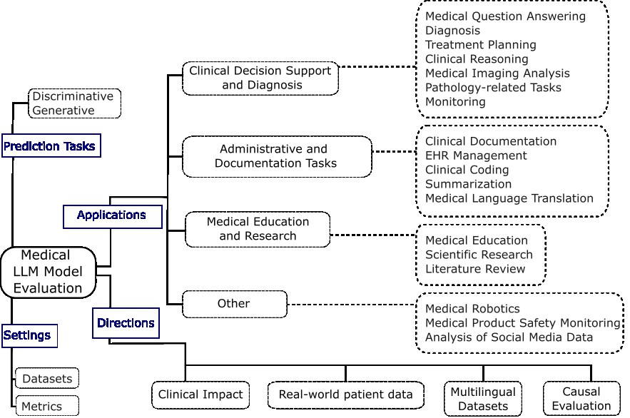

# Medical Large Language Models Evaluation

 
 

A professionally curated list of papers, tutorials, and surveys on recent evaluation of LLMs (Large Language Models), including a taxonomy, review of current evaluation protocols (e.g., datasets and metrics), and promissing lines of research.

Hope this list would be helpful for AI and medical researchers who are interested in deeply understanding the specific challenges of evaluating LLMs in the medical domain.

We will continue to update this list with most recent resources. If you find any missed resources or errors, please feel free to open an issue or make a pull request.

## Survey paper

[**Evaluation of Medical Large Language Models - Taxonomy, Review, and Directions**](papers/p0.pdf) (submitted to IJCAI'25 Survey Track)

## Overview of Medical LLMs Evaluation

 

## Table of Contents

- [Evaluation settings](#evaluation-settings)
  * [Datasets](#datasets)
  * [Metrics](#metrics)
    
- [Medical Applications](#medical-applications)
	1. [Clinical Decision Support and Diagnosis](#clinical-decision-support-and-diagnosis)
	2. [Administrative and Documentation Tasks](#administrative-and-documentation-tasks)
 	3. [Medical Education and Research](#medical-education-and-research)
  4. [Other Applications](#other-applications) 

## Evaluation settings

### Datasets

| Dataset                                                                            | Description                                                                                      | Official Website                                                                                                    | 
|:-----------------------------------------------------------------------------------|:-------------------------------------------------------------------------------------------------|:--------------------------------------------------------------------------------------------------------------------|
| MIMIC-III Clinical Database				 | Deidentified health data associated with ~40,000 critical care patients.													|	[MIMIC-III](https://physionet.org/content/mimiciii/1.4/)																					  |							 
| MIMIC-IV | An update to MIMIC-III, containing deidentified data associated with patients admitted to a tertiary academic medical center in Boston, MA, USA | [MIMIC-IV](https://physionet.org/content/mimiciv/2.2/) | |
| MIMIC-CDM | A MIMIC-IV Derived Dataset for Evaluation of Large Language Models on the Task of Clinical Decision Making for Abdominal Pathologies | [MIMIC-CDM](https://www.physionet.org/content/mimic-iv-ext-cdm/1.0/) |
| PathVQA                               									 | VQA, 32799 Cases QA Pair                                                                         | [Grand Challenge](https://pathvqachallenge.grand-challenge.org/)               																			|    
| SLAKE                                   									 | VQA, 14028  Cases QA Pair                                                                        | [Project Homepage](https://www.med-vqa.com/slake/)                                                                  | 
| MEDALIGN | A clinician-generated dataset for instruction following with electronic medical records. | [MEDALIGN](https://som-shahlab.github.io/medalign-website/) |
| ProbSum | The task contains 768 hospital daily progress notes and 2783 diagnoses in the training set, and a new set of 237 daily progress notes are recently annotated as the test set.  | [ProbSum](https://physionet.org/content/task-1-3-soap-note-tag/1.0.0/) | 
| ICD Billing Codes | | |
| ACI-Bench | | |
| MTS - Dialog | | |
| PriMock57 | | |
| MedQA-USMLE | | |
| Medical Flash Cards | | |
| PubMedQA                                              	 | QA, 1000 Cases Expert annotation QA Pair                         																| [Project Homepage](https://pubmedqa.github.io/)                                																			|
| NCBI Disease | | |
| S2ORC | | |
| ORBIT-Surgical | Physics-based surgical robot simulation framework with photorealistic rendering in NVIDIA Omniverse. | [ORBIT-Surgical](https://orbit-surgical.github.io/) |
| SMM4H | Medication-related text classification and concept normalization from Twitter | [SMM4H](https://data.mendeley.com/datasets/rxwfb3tysd/2) |
| COMETA | Entity linking dataset of layman medical terminology. | [COMETA](https://github.com/cambridgeltl/cometa) |

### Metrics

## Medical Applications

1. ### Clinical Decision Support and Diagnosis
   
	1. Medical Question Answering: This involves answering specific medical questions based on clinical knowledge, medical literature, or patient data.
  
		- Evaluation Focus: The accuracy, precision, and recall of answers, as well as the ability to extract relevant information to answer the question. Also assesses the LLM's ability to provide precise answers to clinical questions regarding symptoms, treatment options, and drug interactions.
    
		- Evaluation Protocol: Datasets of medical questions and answers are used, and the correctness of responses is assessed against expert-validated answers. Performance is measured based on metrics such as token-level F1 scores and exact string matches.

	2. Diagnosis: This includes identifying the nature or cause of a disease or condition through the examination of symptoms, medical history, and diagnostic tests.
  
		- Evaluation Focus: The accuracy of diagnostic predictions, the ability to synthesize patient history, symptoms, and diagnostic test data, and the identification of key factors that contribute to the diagnosis. Also, the ability to identify and categorize critical information such as symptoms, medications, diseases, diagnoses, and lab results from patient EHRs.
    
		- Evaluation Protocol: Compare LLM performance to physician diagnoses, use patient vignettes, assess the LLM's ability to identify the correct diagnosis, measure diagnostic accuracy by comparing LLM predictions with recorded pathologies. This includes allowing for a range of alternative phrasings as long as they are medically correct when evaluating a diagnosis.

	3. Treatment Planning: This involves using LLMs to generate treatment plans.
   
		- Evaluation Focus: The appropriateness and safety of treatment recommendations.

		- Evaluation Protocol: Use real patient scenarios to evaluate the LLM’s ability to generate appropriate treatment plans, and have clinicians verify their safety and efficacy.

	4. Clinical Reasoning: This involves using LLMs for tasks that require logical inference and reasoning in a clinical context [12].

		- Evaluation Focus: The ability of the LLM to draw logical conclusions, understand relationships, and make inferences from clinical data.

		- Evaluation Protocol: Evaluate using case studies that require reasoning, have experts evaluate the reasoning process, and benchmark against established clinical guidelines.

	5. Medical Imaging Analysis: This involves the use of LLMs to interpret and analyze medical images.

		- Evaluation Focus: Accuracy of image interpretation, ability to extract relevant information, and the identification of critical features.

		- Evaluation Protocol: Compare LLM interpretations with expert radiologist reports, use metrics like sensitivity and specificity, and assess the correctness of image analysis.

	6. Pathology-related Tasks: This involves using LLMs to interpret pathology reports or images.

		- Evaluation Focus: Accuracy of analysis, completeness of extracted information, and relevance to the diagnosis or treatment.

		- Evaluation Protocol: Evaluate using expert-annotated datasets, and compare LLM findings with pathologist reports.

	7. Monitoring: This includes tasks like monitoring a patient’s condition or monitoring virus outbreaks.
   
		- Evaluation Focus: Ability to detect changes or anomalies, accuracy of risk assessment, and ability to support timely interventions.

		- Evaluation Protocol: Use real patient data or simulated scenarios to assess the LLM's monitoring capabilities.

2. ### Administrative and Documentation Tasks

	1. Clinical Documentation: This includes tasks such as clinical note-taking and generating medical reports.
	 
		- Evaluation Focus: The accuracy, efficiency, and completeness of clinical notes and generated reports, and their ability to capture relevant clinical information.
  
		- Evaluation Protocol: Compare LLM-generated notes with expert-written notes, and have clinicians assess the completeness, relevance and medical accuracy of the documentation.

	2. Electronic Health Record (EHR) Management: This task refers to the use of LLMs to interact with and manage patient data in EHRs.

		- Evaluation Focus: The ability of the LLM to handle complex information needs, circumvent low-usability EHR interfaces, and accurately retrieve and organize patient data.

		- Evaluation Protocol: Evaluate the LLM's performance on tasks such as data retrieval, organization, and summarization using real EHR data.

	3. Clinical Coding: This includes tasks such as assigning provider billing codes.
   
		- Evaluation Focus: The accuracy and efficiency of generated codes, and adherence to medical and administrative guidelines.

		- Evaluation Protocol: Evaluate using real-world administrative data, measure the accuracy of generated codes, and assess against standardized procedures.

	4. Summarization: This focuses on creating concise summaries of clinical text, such as radiology reports or clinical notes.
   
		- Evaluation Focus: The comprehensiveness and conciseness of summaries, preservation of key information, and clinical relevance.

		- Evaluation Protocol: Compare LLM-generated summaries to those written by clinicians, use metrics like ROUGE scores, and perform human evaluations for clinical utility and interpretability.

	5. Medical Language Translation: This involves translating medical documents between different languages.
   
		- Evaluation Focus: The accuracy, fluency, and preservation of medical meaning in translation.

		- Evaluation Protocol: Use bilingual medical corpora, assess with metrics like BLEU scores, and involve human reviewers to verify the accuracy and appropriateness of translations.

3. ### Medical Education and Research
   
	1. Medical Education: This includes using LLMs to improve the skills and knowledge of healthcare professionals.
   
		- Evaluation Focus: The accuracy of medical knowledge, the ability to enhance skills, and the relevance to evolving healthcare needs.

		- Evaluation Protocol: Measure performance on medical board examinations, assess the quality of generated educational materials, and evaluate the LLM's ability to synthesize complex medical information.

	2. Scientific Research: This involves the use of LLMs to support scientific research in medicine and healthcare.
   
		- Evaluation Focus: The ability of the LLM to support data analysis, research synthesis, and the generation of research insights.

		- Evaluation Protocol: Assess the validity of the LLM's output against scientific benchmarks, involve domain experts to assess the relevance of results, and measure performance on tasks such as data analysis and research synthesis.

	3. Literature Review: This involves summarizing and synthesizing existing research on a specific medical topic.
   
		- Evaluation Focus: The validity of literature summaries, the completeness of literature coverage, and the usefulness of insights for researchers.

		- Evaluation Protocol: Compare LLM-generated reviews with expert-written literature reviews, assess for completeness, and identify any critical oversights.

4. ### Other Applications

	1. Medical Robotics: This involves using LLMs in the field of medical robotics.

		- Evaluation Focus: The ability of LLMs to support robotics in tasks such as surgery, diagnostics, and patient care.

		- Evaluation Protocol: Evaluate the LLM's performance on robot-assisted tasks, assess safety and precision, and gather feedback from clinicians.

	2. Medical Product Safety Monitoring: This includes the use of LLMs to monitor the safety of medical products by identifying adverse events.
   
		- Evaluation Focus: The ability to identify adverse events from social media or other sources.

		- Evaluation Protocol: Compare LLM-detected events with data from regulatory databases and have experts assess the validity of the detected events.

	3. Analysis of Social Media Data: This involves analyzing social media data for health-related information or trends.
   
		- Evaluation Focus: Accuracy of data analysis and identification of health-related trends, ability to interpret nuances of language, and sensitivity to privacy concerns.

		- Evaluation Protocol: Compare the extracted insights with expert analysis and public health data, use NLP metrics for relevance and accuracy.

